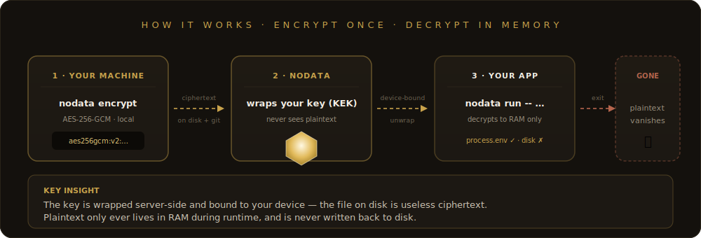

<div align="center">


<br/>


Send passwords, API keys, and credentials securely — without storing anything.

[](LICENSE)
[](https://typescriptlang.org)
[](https://en.wikipedia.org/wiki/Galois/Counter_Mode)

</div>

---

```bash
npx nodata-send "AWS_SECRET_KEY=wJalrXUtn..."
```

```
  Encrypting with AES-256-GCM... done
  Creating zero-data drop... done

  Secure link: https://nodatachat.com/burn/Ab7K2m#x9f2kL...

  View once | 24h TTL | Zero storage

  The decryption key is in the URL fragment (#...)
  The server never sees it.
```

**Stop sending passwords in Slack. Send a burner link instead.**

---

## Why

Every day, teams send secrets through Slack, email, and WhatsApp.
Those messages sit in logs forever.

NoDataChat encrypts on your machine, delivers a one-time link, and deletes everything after the first read. The server **never** sees your plaintext.

## How it works

<div align="center">

</div>


## Use cases

**DevOps**
```bash
npx nodata-send "PROD_DB_PASSWORD=s3cret"       # production credentials
npx nodata-send "ssh-rsa AAAA..." --expire 1h    # SSH key, expires in 1h
echo "$API_TOKEN" | npx nodata-send              # pipe from env
```

**Agencies / Clients**
```bash
npx nodata-send "Admin login: user/p@ssw0rd"     # client credentials
npx nodata-send "WordPress admin: ..."            # temporary access
```

**IT / Helpdesk**
```bash
npx nodata-send "WiFi: CompanyNet / xK9#mP2!"    # office WiFi
npx nodata-send "VPN token: 847291"  --expire 10m # expires in 10 min
```

## CLI commands

| Command | What it does |
|---------|-------------|
| `npx nodata-send "secret"` | Encrypt + create burner link |
| `npx nodata-send "secret" --expire 1h` | Custom expiry (10m, 1h, 24h) |
| `npx nodata-send "secret" --no-burn` | Don't delete after first read |
| `echo "secret" \| npx nodata-send` | Pipe from stdin |
| `npx nodata-proof` | Show Zero-Data architecture claims |

## Packages

```
nodatachat/
  packages/
    core/       Encryption primitives, identity, seed phrase (open source)
    cli/        CLI tools — nodata-send, nodata-proof (open source)
    crypto/     Low-level crypto module (open source)
```

## Security

| Layer | Algorithm |
|-------|-----------|
| Message encryption | AES-256-GCM |
| Key exchange | RSA-OAEP-4096 |
| Key derivation | PBKDF2-SHA256 (310,000 iterations) |
| Hashing | SHA-256 (domain-separated) |
| Anti-spam | Proof of Work (SHA-256 nonce) |

**Design principles:**
- Server never sees plaintext or decryption keys
- No accounts required — identity is a 12-word seed phrase
- Secrets burn after first read
- All crypto uses Web Crypto API (W3C standard)
- Open source — audit the code, verify the claims

## NoDataChat Platform

This repo is the **open-source core** of NoDataChat.

The full platform adds: web app, mobile app, team management, enterprise features, Stripe billing, report boxes, and more.

**Website:** [nodatachat.com](https://nodatachat.com)

---

<div align="center">

**Secrets that self-destruct.**

[Website](https://nodatachat.com) · [CLI Docs](packages/cli/) · [Core API](packages/core/src/README.md) · [Examples](packages/core/examples/)

</div>
